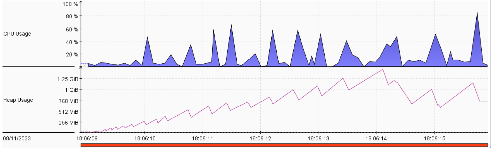
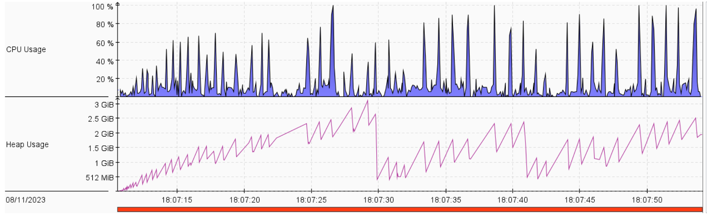
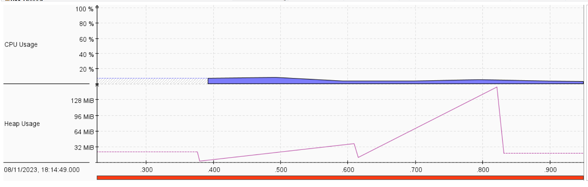
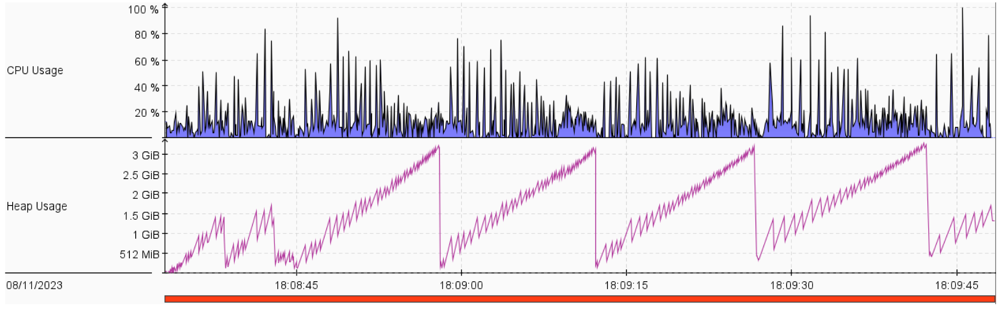
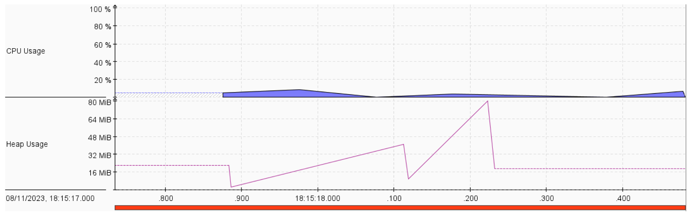
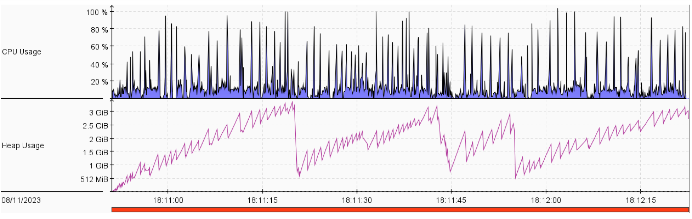
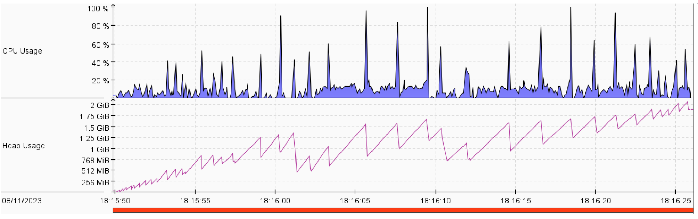
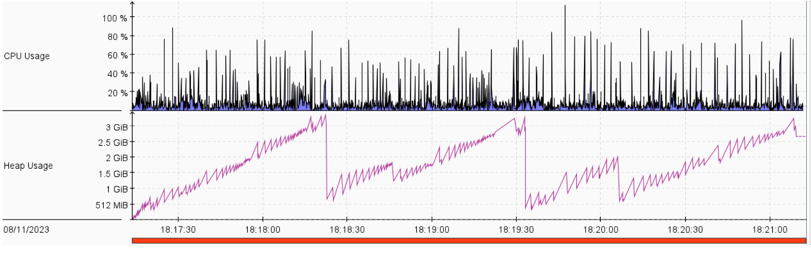
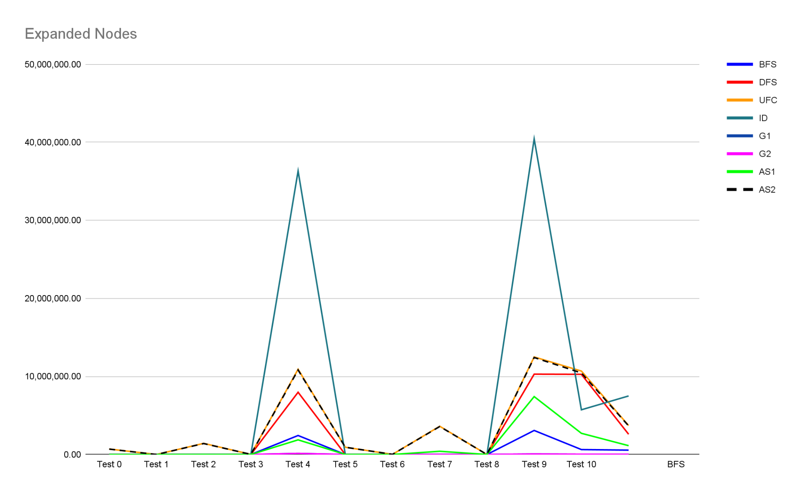

# Live Long And Prosper AI Agent

# Problem Summary

The problem stated there is a town that requires some resources like food, materials and energy. The resources are required for the establishment of new buildings. The buildings add prosperity to towns. The town can request for resources, but they take time to arrive. The goal is to reach prosperity 100. We have a budget of 100,000. The possible actions are:

1. ``RequestFood``: Request a delivery for food resource. A predefined amount of food gets added to the town after a certain time passes.
2. ``RequestEnergy``: Request a delivery for energy resource. A predefined amount of energy gets added to the town after a certain time passes.
3. ``RequestMaterials``: Request a delivery for materials resource. A predefined amount of food gets added to the town after a certain time passes.
4. ``Wait``: Do nothing and just wait a time unit. This consumes one of each resource.
5. ``Build1/2``: Build either house 1 or house 2 respectively. Building either house will consume a certain amount of resources and money. Building adds prosperity.

# Main Components

## Data Types

1. **LLAP Node**: A subclass of **Node** which is an abstract class that contains:
   - `Node parent`: reference to the parent of this Node.
   - `int cost`: the total cost to reach this Node.
   - `String operation`.
     The **LLAPNode** adds the following properties on top of the base class:
   - `int prosperity`: the current prosperity amount.
   - `int food`: the current food amount.
   - `int material`: the current materials amount.
   - `int energy`: the current energy amount.
   - `PendingResource pendingResource`: a reference to a resource that’s been requested but hasn’t arrived yet.
2. **Strategy**: An Enum class that contains constants referring to the search algorithms strategies to be used.
3. **PendingEnergy** / **PendingFood** / **PendingMaterial**: Subclasses of **PendingResource**, and they contain:
   - `int remainingTime`: time left till the resource arrives.
   - `int amount`: how much of that resource will arrive.
4. **Action:** An abstract class that contains how much resources (food, material, and energy) needed to perform this action, and an abstract function `perform(Node currNode)` which performs the action on a specific Node and returns a new Node containing the new state after execution. There are 3 types of actions that extend this base class:
   - `Await`: the agent does nothing, and awaits a pending resource for a single time-step.
   - `Build`: increases the current prosperity.
   - `RequestResource`: requests food, energy, or material which results in creating a new `PendingResource`.

5. **LLAPSearch**
   This class implements our specific problem, the LLAP Problem. There is a static function `solve(String initialState, String strategy, String visualize)` which does the following:
   1. Parses the initial state string to construct the initial `LLAPNode`.
   2. Creates an object of one of the subclasses that implement `GenericSearch` depending on the strategy passed to the solve function.
   3. Calls the `solve` function of the object created, passing the initial `LLAPNode`. This function returns the goal node, if exists.
   4. Calls the `getPlan(Node goalNode)` function to reconstruct the list of actions taken to reach the goal node.

## Search Strategies

These search algorithms are subclasses of the abstract class `GenericSearch`, which contains 2 primary functions:

1. `abstract Node solve()`: overridden in each search strategy class to run a specific algorithm. (returns the goal node or null if there’s no solution)
2. `List<Node> expand(Node node)`: returns a list of all child Nodes after executing all the possible Actions.

### 1. Breadth First Search

#### Implementation

We expand (via `super.expand`) nodes based on a First In, First Out order, as in a queue until the queue is empty, or we reach the goal node.

#### Optimality and Completeness

Not optimal but complete.

#### Average expanded nodes

The average of the expanded nodes across all 11 tests is:
`559,193.18`

#### CPU Utilization and Memory

### 2. Depth First Search

#### Implementation

We expand (via `super.expand`) nodes based on a Last In, First Out order, as in a stack until the stack is empty, or we reach the goal node.

#### Optimality and Completeness

Not optimal, but complete (There is no infinite branch because of the 100,000 limit on the money spent).

#### Average expanded nodes

The average of the expanded nodes across all 11 tests is:
`2,594,574.27`

#### CPU Utilization and Memory

### 3. Greedy Search 1

#### Implementation

We expand (via `super.expand`) nodes based on a heuristic, until the queue is empty, or we reach the goal node. The heuristic used is `100 - currentProsperity`. Simply, We favor nodes with higher prosperity to be expanded first.

#### Optimality and Completeness

Not optimal, but complete.

#### Average expanded nodes

The average of the expanded nodes across all 11 tests is:
`21,412.27`

#### CPU Utilization and Memory

### 4. Greedy Search 2

#### Implementation

We expand (via `super.expand`) nodes based on a heuristic, until the queue is empty, or we reach the goal node. The heuristic used is the following. First, for each building, we calculate the ratio of additional money required over the amount of prosperity we get from. Then we take the minimum between the two ratios and multiply it with the remaining prosperity to reach 100.

#### Optimality and Completeness

Not optimal, but complete.

#### Average expanded nodes

The average of the expanded nodes across all 11 tests is:
`21,412.27`

#### CPU Utilization and Memory

### 5. Iterative Deepening Search

#### Implementation

We loop through the depth and for every depth we perform a limited depth DFS where we expand nodes only until the current depth.

#### Optimality and Completeness

Not optimal, but complete.

#### Average expanded nodes

The average of the expanded nodes across all 11 tests is:
`7,500,673.55`

#### CPU Utilization and Memory

### 6. Uniform Cost Search

#### Implementation

We expand (via `super.expand`) nodes based on the total cost from the root, until the queue is empty, or we reach the goal node. We favor expanding the node with the lowest cost first.

#### Optimality and Completeness

Optimal and complete.

#### Average expanded nodes

The average of the expanded nodes across all 11 tests is:
`3,710,792.73`

#### CPU Utilization and Memory

### 7. A Star 1

#### Implementation

We expand (via `super.expand`) nodes based on total cost from the root + a heuristic, until the queue is empty, or we reach the goal node. We favor expanding nodes with the lowest value first. The heuristic used is the following. First, for each building, we calculate the ratio of additional money required over the amount of prosperity we get from. Then we take the minimum between the two ratios and multiply it with the remaining prosperity to reach 100. It is admissible because the only way to increase prosperity is through `BUILD1` or `BUILD2`. We take the minimum ratio (as described above) between either using `BUILD1` or `BUILD2`. Therefore, there will be no other way to increase prosperity with cost less than calculated heuristic.

#### Optimality and Completeness

Optimal and complete.

#### Average expanded nodes

The average of the expanded nodes across all 11 tests is:
`1,130,682.82`

#### CPU Utilization and Memory

### 8. A Star 2

#### Implementation

We expand (via `super.expand`) nodes based on total cost from the root + a heuristic, until the queue is empty, or we reach the goal node. We favor expanding nodes with the lowest value first. The heuristic used is similar to the one used in A Star 1 but we also consider the cost of the needed resources (money, energy and food) when calculating the ratio. This heuristic is admissible because of the same argument as A Star 1. Therefore, there will be no other way to increase prosperity with cost less than calculated heuristic.

#### Optimality and Completeness

Optimal and complete.

#### Average expanded nodes

The average of the expanded nodes across all 11 tests is:
`1,130,682.82`

#### CPU Utilization and Memory

# Discussion on Expanded Nodes

This graph represents the number of expanded nodes for
every test among all search strategies.

1. **UFC** expanded nodes are larger than most other strategies (This is the tradeoff
   to get the optimal solution).
2. **AS1** expanded much fewer nodes compared to **UFC**, but
   it still got the optimal path.
3. Both **AS1** and **AS2** expanded nodes less than or equal to
   **UFC**.
4. The two greedy strategies tend to expand way fewer
   nodes than other strategies, but they’re not optimal.
5. **ID** in most cases expands more nodes than other
   strategies (the overhead of expanding the lower levels
   over and over again), except in test case 10 it expanded
   less than **DFS** (maybe because it avoided a long
   non-solution branch)

# Discussion on CPU Utilization and Memory

1. Both greedy strategies and **BFS** have lower CPU
   utilization. This may be because they expanded fewer
   nodes than other strategies.
2. Normally, the memory complexity of **DFS** is lower than
   that of **BFS**. However, in our solution, the memory of **DFS**
   was larger than that of **BFS**. This is mostly because of the
   handling of repeated states via a visited set.
3. **A Star 1** strategy shows less memory usage and CPU
   utilization than that of **UFC**.
4. **ID** didn’t show much increase in CPU utilization and
   memory usage compared to **DFS**. However, **ID**
   guarantees that it’ll not get stuck in an infinite path.

# Credits

- https://blog.idrsolutions.com/setting-up-visualvm-in-under-5-minutes/
